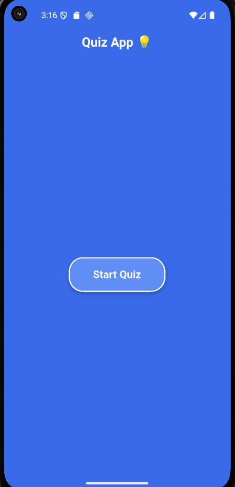
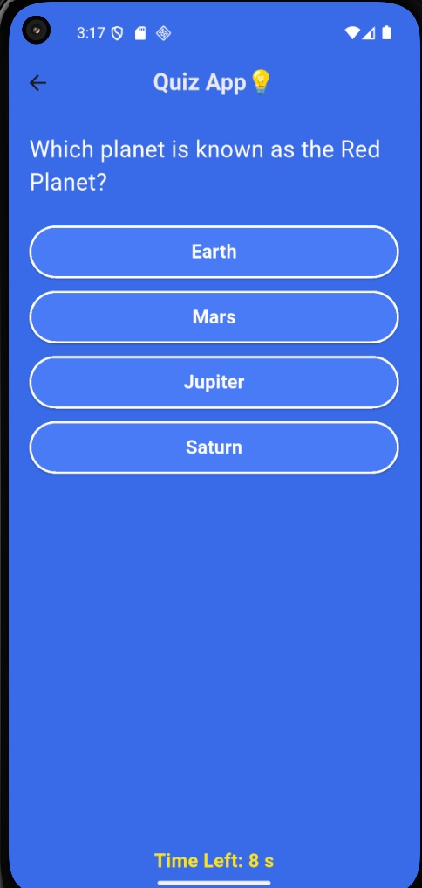
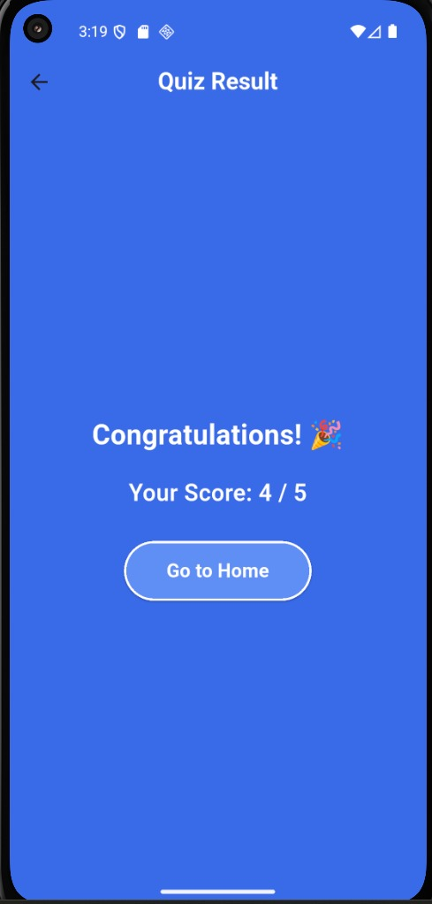

# 📱 Quiz_App

## 🚀 Project Overview

**Quiz_App** is an interactive mobile application built using **Flutter and Dart**. It displays multiple-choice questions with a countdown timer for each, automatically moving to the next if time runs out. The app shows a final score at the end, providing a smooth, fast, and user-friendly quiz experience with a clean blue-themed UI.

---

## 🌟 Features

- 🏠 **Home Screen**
  - Displays app title and quiz instructions.
  - Start Quiz button with elegant hover effects.

- ❓ **Quiz Screen**
  - Displays 5 multiple-choice questions one by one.
  - Each question has 4 options with equal-sized, styled buttons.
  - 10-second countdown timer per question.
  - Auto-skips to the next question if time runs out.

- 🏆 **Result Screen**
  - Shows total score out of 5.
  - Includes a Go to Home button to restart.

---

## 💻 Tech Stack

| **Category** | **Technology** |
|--------------|----------------|
| Language     | Dart           |
| Framework    | Flutter        |
| IDE          | Android Studio |

---

## 📸 Screenshots

| Home Screen | Quiz Screen | Result Screen |
|-------------|-------------|---------------|
|  |  |  |

---

## 📝 How to Run

1. Clone the repository.
2. Open in **Android Studio**.
3. Run `flutter pub get` to fetch dependencies.
4. Launch using an emulator or connected device with `flutter run`.

---

## 🔮 Future Enhancements

- Add category-based quizzes.
- Store high scores locally or in Firebase.
- Implement animations and sound effects for better UX.

---

## 🤝 Connect with Me

 [**M-Attaullah**](https://github.com/M-Attaullah)  
 [**Muhammad Attaullah**](https://www.linkedin.com/in/muhammad-attaullah-705764333/)

---

> 🚀 **Note:** This app is developed as part of my **internship task** to strengthen skills in Flutter UI design, state management, and timer-based event handling.

